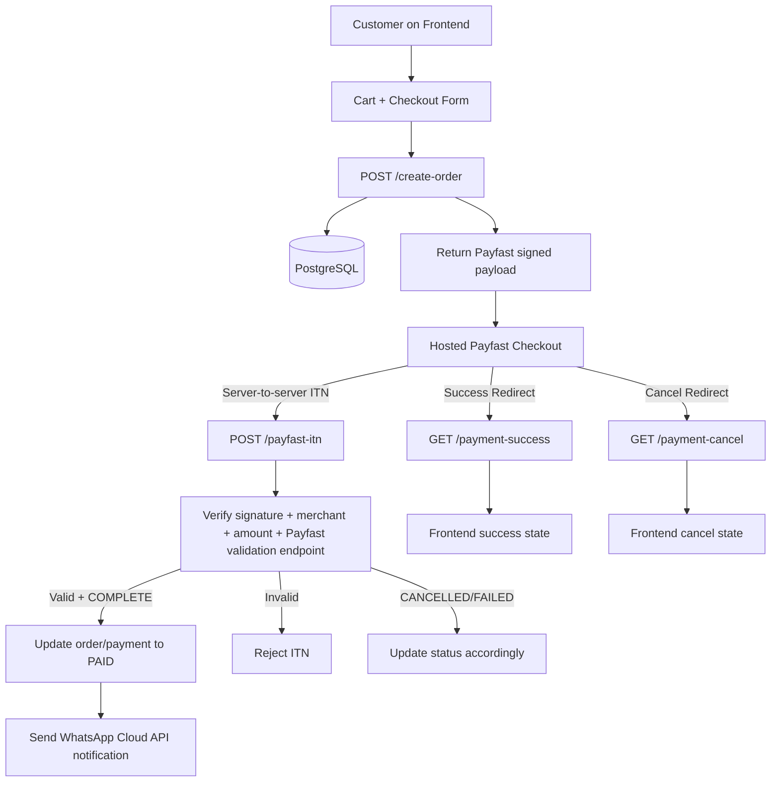

# Cloud 9 Payment Architecture

## Security Boundary
- Cardholder data is never captured in the frontend app or backend server.
- Customers enter card details only on the Payfast hosted checkout page.
- Backend stores payment references/status only.
